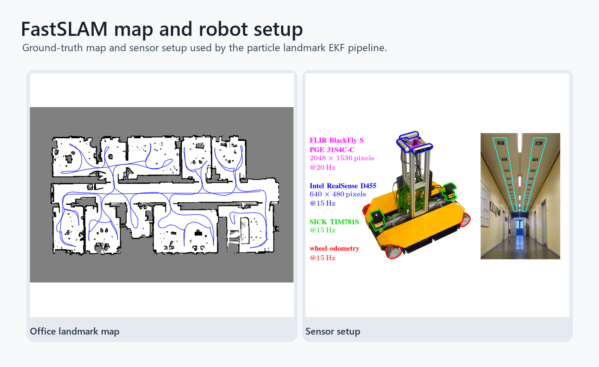

# FastSLAM

FastSLAM for range-bearing landmark observations. Each particle tracks a robot pose, a trajectory, an importance weight, and an independent landmark EKF map. The implementation includes prediction, landmark initialization, EKF correction, likelihood weighting, low-variance resampling, and selective resampling.

## Run

```bash
python mobile_robotics_fastslam.py
```

Runtime parameters are stored in `params.txt`.

## Example output



Ground-truth landmark map and robot sensor setup used by the FastSLAM experiment.


## Algorithm notes

- FastSLAM structure with per-particle landmark EKFs.
- Prediction, landmark initialization, correction, weighting, and selective resampling.
- Parameter-driven experiments against a prepared office-map dataset.


## Validation and next steps

- The full visualization path is heavier than the compact README smoke test.
- Performance depends on particle count and noise assumptions in params.txt.
- Next steps: save trajectory overlays automatically and add runtime/accuracy summaries.

